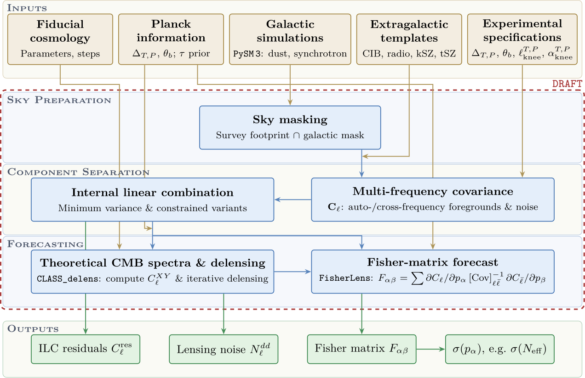

# DRAFT: Dark Radiation Anisotropy Flowdown Team forecasting tool

End-to-end forecasting pipeline for cosmic microwave background (CMB)
experiments, from experimental specifications to projected constraints on
cosmological parameters.

The **DRAFT** (Dark Radiation Anisotropy Flowdown Team) forecasting tool
was developed within the Maps-to-Power-Spectra analysis working group of the
CMB-S4 collaboration and is described in arXiv:2608.XXXXX. It is not
specific to CMB-S4 and can be applied directly to other survey designs: the
experiment library already covers Planck, the South Pole Telescope, the Simons
Observatory, CMB-HD and AtLAST alongside the CMB-S4 surveys.

## What it does



The pipeline targets damping-tail science (e.g. neutrinos and other light
relics), where the constraining power lies at multipoles above ℓ ≈ 1000, but
astrophysical foreground emission is significant relative to the primary signal
and gravitational lensing broadens the acoustic peaks. Foreground modeling,
component separation and delensing are therefore all needed to extract the
available information. The pipeline runs in three stages, all implemented in
this repository.

**Sky preparation.** The survey footprint is combined with a galactic mask to
remove the most contaminated regions of the sky, which component separation can
only partially clean.

**Component separation.** A harmonic-space internal linear combination (ILC)
optimally combines the frequency bands, down-weighting modes dominated by
foregrounds or instrumental noise and leaving the residual power spectra. The
standard minimum-variance, constrained and partial variants are supported
(cross-ILC is still to be ported).

**Forecasting.** The post-ILC noise spectra drive the iterative delensing
performed by [CLASS_delens](https://github.com/selimhotinli/class_delens) and
the Fisher-matrix forecast performed by
[FisherLens](https://github.com/ctrendafilova/FisherLens), both of which are
run from within this repository.

Two drivers are run from the repository root: `get_ilc_residuals.py` computes
ILC residual spectra for one experiment configuration, and
`get_fisher_forecasts.py` reads one or more of those products and returns a
Fisher forecast using delensed CMB power spectra.

## Documentation

The documentation is built with Sphinx from [docs/](docs/). A rendered copy is
committed at [docs/build/html/index.html](docs/build/html/index.html), which
opens directly after cloning. (Read the Docs will be added later.)

<!-- Once the project is live on Read the Docs, replace the sentences above
     with: The documentation is available at <URL>. -->

## Getting started

Clone the repository and run the drivers from its root. (There is no installable
package yet, so `pip install .` does not work.)

```bash
git clone https://github.com/sriniraghunathan/DRAFT.git
cd DRAFT
pip install numpy scipy
```

That is all component separation needs. A first run, computing ILC residuals
for the CMB-S4 Wide survey of the conceptual design with galactic foregrounds
included and the Planck GAL090 mask applied:

```bash
python3 get_ilc_residuals.py -expname s4wide_202310xx_pbdr_config \
    -include_gal 1 -which_gal_mask 2 -final_comp cmb
```

<!-- Once tutorial.ipynb runs end to end against the current repository layout,
     add: [tutorial.ipynb](tutorial.ipynb) works through the same pipeline
     interactively, from the experiment specifications and the foreground model
     to the ILC residuals, delensed spectra and the resulting forecast. -->

Forecasting additionally needs CAMB, a C compiler and `make` since it drives
the two companion codes. FisherLens is a submodule of this repository and
brings CLASS_delens as a submodule of its own, so the checkout has to be
recursive:

```bash
pip install camb
git submodule update --init --recursive
cd FisherLens/CLASS_delens
make class
```

Use the `class` target rather than `make` or `make all`, which also need Cython
to build the `classy` Python wrapper. That wrapper does not contain the
delensing routines FisherLens and DRAFT employ.

A forecast reads ILC products rather than recomputing them, so it can be run
directly against a released one:

```bash
ilc=products/202310xx_PBDR_config/s4wide_202310xx_pbdr_config/s4wide_202310xx_pbdr_config_ilc_galaxy1_27-39-93-145-225-278_TT-EE_galmask2_AZ_lmax6500_for7years.npy
python3 get_fisher_forecasts.py -ilc_fname $ilc -fsky auto -label s4wide
```

Several products can be given at once so that the surveys and sky patches of a
configuration are combined into one forecast, and `-fsky auto` uses the sky
fraction recorded in the respective product.

The cosmology, the step sizes, the multipole ranges and the foreground
configuration are read from [params.ini](params.ini) and
[params_fisher.ini](params_fisher.ini) rather than from the command line, so a
run is reproducible from a file. See the
[installation](docs/source/installation.rst) and
[quickstart](docs/source/quickstart.rst) pages for the full requirements, every
argument the drivers take and the equivalent Python API.

## Released data products

[products/](products/) ships precomputed ILC residual power spectra and
lensing-reconstruction noise curves for a range of survey configurations. These
can be used as inputs to other forecasting frameworks, including other Fisher
codes or MCMC-based approaches, without running anything here. Three trees are
included, covering the CMB-S4 two-site conceptual design and the Chile-only
revised configuration alongside Simons Observatory and South Pole Telescope
configurations.

A product filename records the configuration, the bands, the spectra, the
galactic mask and the integration time, as in the file used in the forecast
above. Each file holds a pickled dictionary, for which `get_fisher_forecasts`
supplies the readers:

```python
import get_fisher_forecasts as gff

ilc = gff.load_ilc_product('<ilc product>')
el, cl_residual = ilc['el'], ilc['cl_residual']['TT']
```

The full filename grammar, the dictionary keys, the file formats and the
coverage of each tree are documented on the
[products](docs/source/products.rst) page.

## Citing

If you use DRAFT or the released data products, please cite the tool together
with the paper describing the pipeline and the forecasts:

* S. Raghunathan, J. Meyers, C. Trendafilova & B. Wallisch,
  *DRAFT: Dark Radiation Anisotropy Flowdown Team Forecasting Tool*,
  https://github.com/sriniraghunathan/DRAFT (2026).
* C. Trendafilova, S. Raghunathan, B. Wallisch, J. Meyers et al.
  (CMB-S4 Collaboration), *Sensitivity of Next-Generation CMB Surveys to
  Neutrinos and Other Light Relics*, arXiv:2608.XXXXX.

The [references](docs/source/references.rst) page lists the further work
underlying the foreground models, the component separation, and the delensing
and forecasting stages, which should be cited depending on your use of DRAFT.

## Authors

Srinivasan Raghunathan, Joel Meyers, Cynthia Trendafilova and Benjamin
Wallisch.
