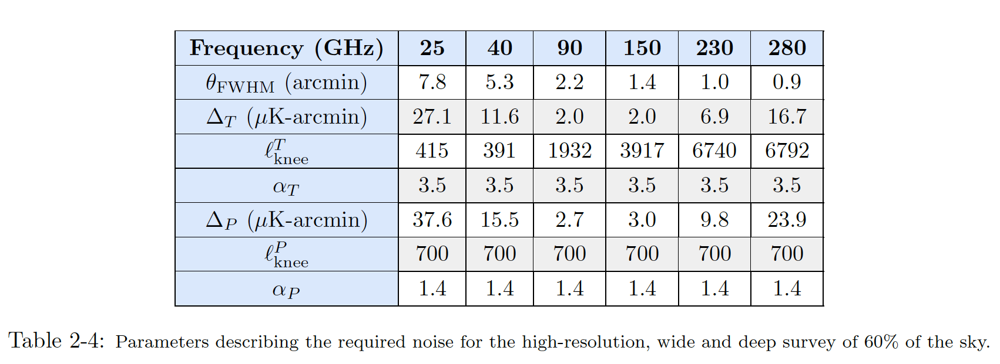
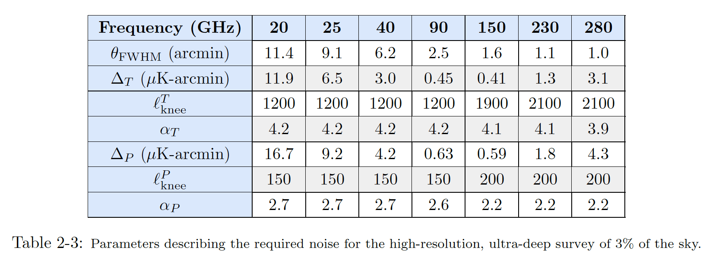

# CMB-S4: Dark Radiation Anisotropy Flowdown Team (DRAFT) tool

## Articles to cite: 
* If you use results from this repository, please cite the following articles.
* ILC residuals:
  *  Raghunathan and Omori, 2023, arXiv:[2304.09166](https://arxiv.org/abs/2304.09166).
* Fisherlens:
  * Green, Meyers, van Engelen 2016, arXiv: [1609.08143](https://arxiv.org/abs/1609.08143).
  * Hotinlini, et al. 2023, arXiv: [2111.15036](https://arxiv.org/abs/2111.15036).
* This tool also uses results from the following:
  * Extragalacitc foreground modelling: Reichardt et al. 2021, arXiv: [2002.06197](https://arxiv.org/abs/2002.06197).
  * Galactic foreground modelling: https://pysm3.readthedocs.io/en/latest/

### Results:
* **ILC curves**:
  * Look into this [link](https://github.com/sriniraghunathan/DRAFT/tree/master/products/202310xx_PBDR_config/).
     *  File name:
        * Without galactic foregrounds: [expname]_galaxy0_[bands]_TT-EE_lmax6500_for7years.npy
        * With galactic foregrounds: [expname]_galaxy0_[bands]_TT-EE_galmask[0_or_1_or_2]_lmax6500_for7years.npy
           * Galactic foregrounds masks can be found here: [planck_gal_fg_mask_with_cmbs4_footprint](https://github.com/sriniraghunathan/DRAFT/blob/master/data/planck_gal_fg_masks_with_cmbs4_footprint.png) 
           * 0 - GAL070 + CMB-S4 footprint.
           * 1 - GAL080 + CMB-S4 footprint.
           * 2 - GAL090 + CMB-S4 footprint.
     *  [S4-Wide (Chilean LAT)](https://github.com/sriniraghunathan/DRAFT/tree/master/products/202310xx_PBDR_config/s4wide_202310xx_pbdr_config): This is for the latest noise specs from PBDR (as of Oct 2023).
     *  [S4-Ultra deep (South Pole LAT](https://github.com/sriniraghunathan/DRAFT/tree/master/products/202310xx_PBDR_config/s4deepv3r025_202310xx_pbdr_config): This is for the latest noise specs from PBDR (as of Oct 2023).
     *  [S4-Wide (Chilean LAT) achevied performance](https://github.com/sriniraghunathan/DRAFT/tree/master/products/202310xx_PBDR_config/s4wide_acheived_performance_pbdr_202312xx): This is best performance that can be acheived.
     * Look into [read_ilc_residuals.py](https://github.com/sriniraghunathan/DRAFT/blob/master/products/202310xx_PBDR_config/read_ilc_residuals.py) script to read ILC curves.
     * Look into [read_lensing_noise.py](https://github.com/sriniraghunathan/DRAFT/blob/master/products/202310xx_PBDR_config/read_lensing_noise.py) script to lensing noise curves. 
     
### CMB-S4 instrument/noise specs:

  
  

### Overview:
* Optimally combines data from different bands using noise + foreground signals in different bands.
  * Supports standard / constrained / partial internal linear combinations.
* Combines delensed CMB spectra and lensing spectra to forecast cosmological parameter constraints using Fisher formalism.
  * Delensing reference: Green, Meyers, van Engelen 2016, arXiv: [1609.08143](https://arxiv.org/abs/1609.08143).
  * [Fisher code repo](https://github.com/sriniraghunathan/cmbs4_fisher_forecasting) **(yet to be integrated into this repo)**.
* Estimates biases in cosmological parameters due to residual foregrounds also using Fisher formalism.
  * References: Huterer & Takada 2004, arXiv: [0412142](https://arxiv.org/abs/astro-ph/0412142); Loverde, Hui, & Gaztanaga 2006, arXiv: [0611539](https://arxiv.org/abs/astro-ph/0611539); Amara & Réfrégier 2007, arXiv: [0710.5171](https://arxiv.org/abs/0710.5171).

### Foreground modelling:
* **Extragalactic foregrounds**: Radio, CIB, tSZ and  kSZ power spectra from SPT measurements (George et al. 2015, arXiv: [1408.3161](https://arxiv.org/abs/1408.3161) and Reichardt et al. 2020, arXiv: [2002.06197](https://arxiv.org/abs/2002.06197)).
  * Assumed polarisation fractions: CIB = 2%; Radio = 3%; tSZ/kSZ = 0. But these are configurable. Look into [params.ini](https://github.com/sriniraghunathan/DRAFT/blob/master/scripts/notebooks/params.ini).
* **Galactic foregrounds**: Dust and Synchrotron power spectra obtained from [pySM3](https://github.com/CMB-S4/s4mapbasedsims/tree/master/202002_foregrounds_extragalactic_cmb_tophat) simulations.

<!--### Results:
* **ILC curves**:
  * Look into this [link](https://github.com/sriniraghunathan/DRAFT/tree/master/results/20210506_with202102designtoolinputforpySM3sims_sedscalingfordust/). 
     * Look into *read_file.py* script to read ILC curves. 
     * Standard ILC curves for S4-Wide (PBDR configuration) will be under this [link](https://github.com/sriniraghunathan/DRAFT/tree/master/results/20210506_with202102designtoolinputforpySM3sims_sedscalingfordust/s4like_mask_v2/TT-EE/baseline). 
     * Constrained ILC curves (for galactc dust) are also in the above folder. 
 -->

## Contributors: 
[_Joel_ **Meyers**](https://joelmeyers.github.io/), [_Cynthia_ **Trendafilova**](https://github.com/ctrendafilova), and [_Benjamin_ **Wallisch**](https://www.ias.edu/scholars/benjamin-wallisch).
